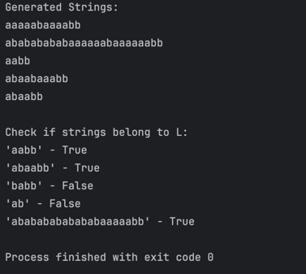

# Topic: Intro to formal languages. Regular grammars. Finite Automata

### Course: Formal Languages & Finite Automata
### Author: Mihaela Untu | FAF-232

----

## Theory
Formal languages help in understanding how languages are structured and processed. A formal language consists of an alphabet (a finite set of symbols) and a set of valid strings formed using these symbols, following specific rules known as grammar. Regular grammars, a subset of formal grammars, simplify production rules and can describe many natural and artificial languages, but they cannot capture the full complexity of all languages.

A grammar G is usually defined as a tuple `G = (V_N, V_T, P, S)`, where:

- **`V_N`** is a set of non-terminal symbols.
- **`V_T`** is a set of terminal symbols.
- **`P`** is a set of production rules that define how strings are formed.
- **`S`** is the start symbol, a non-terminal that initiates string generation.

Regular grammars define regular languages, which are a type of formal language. They come in two forms: **right-linear grammars** and **left-linear grammars**.

- **Right-linear grammar** follows rules like `A → aB` or `A → a`, where `A` and `B` are non-terminal symbols and `a` is a terminal.
- **Left-linear grammar** follows rules like `A → Ba` or `A → a`, with a similar structure.

Regular languages can be processed by **finite automata**, abstract machines that read input symbol by symbol, transitioning between states according to predefined rules.

A **finite automaton (FA)** is defined as a tuple `FA = (Q, Σ, δ, q_0, F)`, where:

- **`Q`** is a finite set of states.
- **`Σ`** is the input alphabet.
- **`δ`** is the transition function `δ: Q × Σ → Q`, determining state transitions based on input symbols.
- **`q_0`** is the initial state from which processing starts.
- **`F`** is a set of accepting states.

To convert a grammar into a finite automaton, we map grammar components (non-terminals, terminals, production rules, and start symbol) to automaton elements (states, alphabet, transition function, initial state, and accepting states). This allows regular grammars to be represented and processed using finite automata.

## Objectives:
* Implement a type/class for your grammar;
* Add one function that would generate 5 valid strings from the language expressed by your given grammar;
* Implement some functionality that would convert and object of type Grammar to one of type Finite Automaton;
* For the Finite Automaton, please add a method that checks if an input string can be obtained via the state transition from it;


## Implementation description

### **1. `Grammar` Class (Defines the Regular Grammar)**
This class defines a **regular grammar** with:
- **`vn`**: A set of **non-terminal symbols** (`S, A, B, C`).
- **`vt`**: A set of **terminal symbols** (`a, b`).
- **`p`**: The **production rules** that describe valid transformations between symbols.
- **`start_symbol`**: The initial state of the grammar (`S`).

The **`generate_string()`** method generates a **valid string** by recursively replacing non-terminals with randomly chosen production rules until only terminal symbols remain.

```python
import random
from finite_automaton import FiniteAutomaton

class Grammar:
    def __init__(self):
        self.vn = {'S', 'A', 'B', 'C'}
        self.vt = {'a', 'b'}
        self.p = {
            'S': ['aA'],
            'A': ['bS', 'aB'],
            'B': ['bC', 'aB'],
            'C': ['aA', 'b']
        }
        self.start_symbol = 'S'

    def generate_string(self):
        string = self.start_symbol
        while any(v in string for v in self.vn):
            for v in string:
                if v in self.vn:
                    string = string.replace(v, random.choice(self.p[v]), 1)
                    break
        return string
```

### **2. `to_finite_automaton()` (Converts Grammar to FA)**
This method **constructs a finite automaton (FA)** using:
- **`q`**: The **states** (same as non-terminals).
- **`sigma`**: The **alphabet** (same as terminal symbols).
- **`q0`**: The **start state** (`S`).
- **`delta`**: The **transition function**, mapping input symbols to new states based on production rules.
- **`f`**: The **final states**, determined as states that only produce terminal symbols (`C` is manually added as a final state).

```python
    def to_finite_automaton(self):
        q = self.vn  # states
        sigma = self.vt  # alphabet
        q0 = self.start_symbol  # start state
        delta = {}  # transition func

        for key in self.p.keys():
            for rule in self.p[key]:
                if key not in delta:
                    delta[key] = []
                if len(rule) == 2:
                    delta[key].append((rule[0], rule[1]))  # (input symbol, next state)
                else:
                    delta[key].append((rule[0], None))  # terminal transition

        # find final states (terminal only strings)
        f = {key for key in self.p if all(rule in self.vt for rule in self.p[key])}
        f.add('C')  # C is final state

        return FiniteAutomaton(q, sigma, delta, q0, f)
```

### **3. `FiniteAutomaton` Class (Simulates a FA)**
This class models a **finite automaton** with:
- **`q, sigma, delta, q0, f`**: Representing the states, alphabet, transition function, start state, and final states.
- **`string_belongs_to_language()`**: A method that:
  - **Simulates state transitions** based on input symbols.
  - **Checks if the final state is in `f`** to determine whether the string belongs to the language.

```python
class FiniteAutomaton:
    def __init__(self, q, sigma, delta, q0, f):
        self.q = q  # states
        self.sigma = sigma  # alphabet
        self.delta = delta  # transition func
        self.q0 = q0  # start state
        self.f = f  # accept states

    def string_belongs_to_language(self, input_string):
        current_state = self.q0

        for c in input_string:
            if c not in self.sigma or current_state not in self.delta:
                return False

            next_state = None
            for transition in self.delta[current_state]:
                if c == transition[0]:  # if the transition matches input
                    next_state = transition[1] if transition[1] is not None else current_state
                    break

            if next_state is None:
                return False  # no valid transition

            current_state = next_state

        return current_state in self.f
```

### **4. Testing the Implementation**
The script **generates and prints** five valid strings using `grammar.generate_string()`.

It **checks whether test strings belong to the language** using `fa.string_belongs_to_language()`, printing `True` or `False` for each test case.

```python
from grammar import Grammar

grammar = Grammar()

print("Generated Strings:")
for _ in range(5):
    print(grammar.generate_string())

fa = grammar.to_finite_automaton()

print("\nCheck if strings belong to L:")
test_strings = ["aabb", "abaabb", "babb", "ab", "abababababababaaaaabb"]
for s in test_strings:
    print(f"'{s}' - {fa.string_belongs_to_language(s)}")
```

## Conclusions / Screenshots / Results

The execution of the **Grammar to Finite Automaton conversion** and the **string recognition process** was successful.

**String Generation Results**:
   - The system **generates valid strings** from the given grammar.
   - Each string follows the production rules defined in the grammar.

**Finite Automaton String Validation**:
   - The automaton correctly classified strings as **belonging (TRUE)** or **not belonging (FALSE)** to the language.
   - Example:
     

## References
1. COJUHARI Irina, DUCA Ludmila, FIODOROV Ion. "Formal Languages and Finite Automata: Guide for practical lessons". Technical University of Moldova.
2. https://youtu.be/Qa6csfkK7_I?si=-Sg9Qw_mAkwJuyeg
3. https://youtu.be/40i4PKpM0cI?si=eWi_u3OKvIm9gTo5