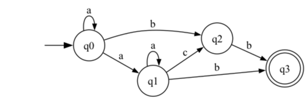

# Determinism in Finite Automata. Conversion from NDFA 2 DFA. Chomsky Hierarchy.

### Course: Formal Languages & Finite Automata

### Author: Mihaela Untu | FAF-232 | V-28

----

## Theory

### Finite Automata

Automata theory is the study of abstract computational devices (abstract state machine). An automaton is an abstract
model of a digital computer. As such, every automaton includes some essential features. It has a mechanism for reading
input. It will be assumed that the input is a string over a given alphabet. The input mechanism can read the input
string from left to right, one symbol at a time and it can be detected the end of the string. The automaton can produce
the output of some form and has a control unit, which can be in any one of a finite number of internal states, and which
can change state in some defined manner based on transition functions.

The finite automaton (FA) is characterized by the finite number of states and it is known the following types of the FA:

- Deterministic finite automaton (DFA) - each input symbol leads to exactly one state.
- Nondeterministic finite automaton (NFA) - n input symbol can lead to multiple states, and transitions can include ε (
  empty string) moves.
- ε - Nondeterministic finite automaton (ε–NFA).

### Deterministic Finite Automaton (DFA)

A deterministic finite automaton is a 5-tuple (Q, Σ, δ, q0, F) where:

- Q is a finite set of states.
- Σ is an input alphabet.
- δ is a transition function, δ: Q × Σ → Q.
- q0 is the intial state.
- F is a set of final states.

### Nondeterministic Finite Automaton (NFA)

A nondeterministic finite automaton is a 5-tuple (Q, Σ, δ, q0, F) where:

- Q is a finite set of states.
- Σ is an input alphabet.
- δ is a transition function, δ: Q × Σ → 2^Q.
- q0 is the intial state.
- F is a set of final states.

**Differences from the DFA:**

- transition function δ can go into several states.
- it can have ε-transitions.

### Chomsky Hierarchy

The Chomsky hierarchy is a classification of formal grammars, each of which generates a class of formal languages. It is
named after its creator, Noam Chomsky. The Chomsky hierarchy is a containment hierarchy of classes of formal grammars.
Each class of grammar generates a class of formal languages. The hierarchy is based on the expressive power of the
grammar. The Chomsky hierarchy is a powerful tool for understanding the capabilities and limitations of different
classes of formal grammars and formal languages.

The Chomsky hierarchy classifies formal grammars into four types based on their complexity:

- **Type 0**: Recursively enumerable grammar.
- **Type 1**: Context-sensitive grammar.
- **Type 2**: Context-free grammar.
- **Type 3**: Regular grammar (right-linear or left-linear)

## Objectives:

1. Understand what an automaton is and what it can be used for.

2. Continuing the work in the same repository and the same project, the following need to be added:

   a. Provide a function in your grammar type/class that could classify the grammar based on Chomsky hierarchy.

   b. For this you can use the variant from the previous lab.

3. According to your variant number (by universal convention it is register ID), get the finite automaton definition and
   do the following tasks:

   a. Implement conversion of a finite automaton to a regular grammar.

   b. Determine whether your FA is deterministic or non-deterministic.

   c. Implement some functionality that would convert an NDFA to a DFA.

   d. Represent the finite automaton graphically (Optional, and can be considered as a __*bonus point*__):

    - You can use external libraries, tools or APIs to generate the figures/diagrams.

    - Your program needs to gather and send the data about the automaton and the lib/tool/API return the visual
      representation.

Please consider that all elements of the task 3 can be done manually, writing a detailed report about how you've done
the conversion and what changes have you introduced. In case if you'll be able to write a complete program that will
take some finite automata and then convert it to the regular grammar - this will be **a good bonus point**.

## Implementation description

- For the first task of this laboratory work I have implemented a method in the Grammar class to classify the grammar.
  The method checks the structure of the production rules and determines the grammar type.
   ```python
   class Grammar:
       def classify_chomsky(self):
           is_type_3 = True  # Regular grammar
           is_type_2 = True  # Context-free grammar
           is_type_1 = True  # Context-sensitive grammar
           is_type_0 = True  # Unrestricted grammar (default)
   
           for left, right_rules in self.p.items():
               for right in right_rules:
                   if len(left) > len(right):  # Context-sensitive check
                       is_type_1 = False
                   if len(left) > 1 or not left.isupper():  # Context-free check
                       is_type_2 = False
                   if len(right) > 2 or (len(right) == 2 and not right[0].islower()):
                       is_type_3 = False  # Regular grammar check
   
           if is_type_3:
               return "Type 3: Regular Grammar"
           elif is_type_2:
               return "Type 2: Context-Free Grammar"
           elif is_type_1:
               return "Type 1: Context-Sensitive Grammar"
           else:
               return "Type 0: Unrestricted Grammar"
   ```
  The `classify_chomsky` method works by figuring out what type of grammar we’re dealing with based on its rules. It
  starts by assuming the grammar is as simple as possible (Type 3, Regular Grammar) and then checks if it needs to be
  moved to a more complex type.

  For each rule, it looks at the left-hand side (LHS) and the right-hand side (RHS). If the LHS is longer than the RHS,
  the grammar can’t be context-sensitive (Type 1). If the LHS isn’t a single non-terminal symbol, it can’t be
  context-free (Type 2). And if the RHS has more than two symbols or doesn’t follow the pattern of a terminal followed
  by a non-terminal, it can’t be regular (Type 3).

  After checking all the rules, the method decides the grammar type. If everything fits Type 3, it’s Regular. If not, it
  checks for Type 2, then Type 1, and if none of those work, it defaults to Type 0 (Unrestricted Grammar). This
  step-by-step process makes sure the grammar is classified correctly based on the Chomsky hierarchy.


- For the second task of this laboratory work I have implemented a method that converts a finite automaton to a regular
  grammar. This involves mapping the transitions of the automaton to production rules.

   ```python
    def finite_automaton_to_grammar(self, fa):
        grammar_rules = {}

        states = sorted(fa.q)
        state_mapping = {}

        if len(states) >= 1:
            state_mapping[states[0]] = 'S'
        if len(states) >= 2:
            state_mapping[states[1]] = 'A'
        if len(states) >= 3:
            state_mapping[states[2]] = 'B'
        if len(states) >= 4:
            state_mapping[states[3]] = 'C'

        for state in states:
            new_state_name = state_mapping.get(state, "")
            if new_state_name:
                grammar_rules[new_state_name] = []

                #add ε-production if the state is final
                if state in fa.f:
                    grammar_rules[new_state_name].append("ε")

                #transitions as grammar rules
                if state in fa.delta:
                    for symbol, next_states in fa.delta[state].items():
                        for next_state in next_states:
                            mapped_next_state = state_mapping.get(next_state, "")
                            grammar_rules[new_state_name].append(symbol + mapped_next_state)
        return grammar_rules
   ``` 

    The behind idea is quite simple, this function converts a finite automaton (FA) into an equivalent regular grammar by systematically mapping states to non-terminals and transforming transitions into production rules. It first sorts the states and assigns them new names, ensuring that the initial state is always mapped to `S`, followed by `A`, `B`, and `C` for the subsequent states. Once the state mapping is established, the function iterates through each state to construct the corresponding grammar rules. 

    If a state is final, an ε-production is added to indicate that the grammar can generate an empty string from that state. The function then examines the FA’s transition function, extracting the transitions and converting them into production rules by appending the transition symbol followed by the corresponding mapped state. If a transition leads to multiple states, each resulting rule is included separately to maintain accuracy. 

    Finally, the function returns a dictionary where the keys represent non-terminal symbols corresponding to the original states, and the values are lists of production rules. This ensures that the FA’s structure is effectively translated into a right-linear grammar, preserving its language.


- For the third task of this laboratory work I have implemented a method to check if the automaton is deterministic by ensuring no state has multiple transitions for the same input symbol.

    ```python
        def is_deterministic(self):
        for state, transitions in self.delta.items():
            seen_symbols = set()
            for symbol in transitions:
                if symbol in seen_symbols:
                    return False
                seen_symbols.add(symbol)
        return True
    ```

    In this approach, I checked whether the finite automaton is deterministic by iterating through each state's transitions. For each state, I maintained a set to track the input symbols encountered. If a symbol appeared more than once, it meant the state had multiple transitions for the same input, making the automaton non-deterministic. Otherwise, if all symbols were unique across transitions, the automaton was deterministic. Finally, the function returns `True` if no duplicate symbols were found, ensuring a well-defined transition structure.


- For the fourth task of this laboratory work I have implemented a method in the FiniteAutomaton class that converts a
  NFA (non-deterministic finite automaton) to a DFA (deterministic finite automaton).

    ```python
        def convert_ndfa_to_dfa(self):
        dfa_states = {}
        queue = []
        start_state = frozenset([self.q0])
        dfa_states[start_state] = "q0"
        queue.append(start_state)
        dfa_transitions = {}
    
        while queue:
            current_set = queue.pop(0)
            dfa_state_name = dfa_states[current_set]
            for symbol in self.sigma:
                new_set = set()
                for state in current_set:
                    if state in self.delta and symbol in self.delta[state]:
                        new_set.update(self.delta[state][symbol])
                if new_set:
                    frozen_new_set = frozenset(new_set)
                    if frozen_new_set not in dfa_states:
                        dfa_states[frozen_new_set] = f"q{len(dfa_states)}"
                        queue.append(frozen_new_set)
                    dfa_transitions[dfa_state_name, symbol] = dfa_states[frozen_new_set]
        return dfa_transitions, dfa_states
    ```

    In this method, I converted an NFA into a DFA by creating a new mapping of DFA states to sets of NFA states. I started with the initial NFA state and kept track of unexplored states in a queue. For each state, I checked all input symbols to see which new states could be reached. If a new set of states appeared, I added it to the DFA and queued it for processing. I also checked if any of these states included an NFA final state—if they did, I marked them as final in the DFA. In the end, I returned the new DFA’s transitions and states.


- For the fifth task of this laboratory work I have implemented a method in the FiniteAutomaton class that represents
  the finite automaton graphically. I used the graphviz library to visualize the automaton. The method creates a graph with states as nodes and transitions as edges.

    ```python
        def draw_automaton(self, filename="finite_automaton"):
        dot = Digraph(format='png')
        dot.attr(rankdir="LR", size="8")  # Left-to-right layout
        for state in self.q:
            shape = "doublecircle" if state in self.f else "circle"
            dot.node(state, shape=shape)
        dot.node("start", shape="none", label="")  # Invisible start node
        dot.edge("start", self.q0, label="")  # Edge to the actual start state
        for state, transitions in self.delta.items():
            for symbol, next_states in transitions.items():
                for next_state in next_states:
                    dot.edge(state, next_state, label=symbol, arrowsize="0.7")
        dot.render(filename, format="png", cleanup=False)
        print(f"Automaton visualization saved as {filename}.png")
    ```

    For this task I used the graphviz library to generate the graph of the finite automaton. I added the states and the
transitions to the graph and I marked the initial state. Then I returned the graph.


## Conclusions / Screenshots / Results
In conclusion, in this laboratory work, I successfully implemented a method to classify grammars based on the Chomsky hierarchy, a function to convert a finite automaton to a regular grammar, a method to check if a finite automaton is deterministic, a function to convert an NFA to a DFA, a visualization tool for finite automata using graphviz.
These implementations helped me better understand the concepts of finite automata and formal grammars.

Below is the Program output:


And the Automaton Visualization:


## References

1. COJUHARI Irina, DUCA Ludmila, FIODOROV Ion. "Formal Languages and Finite Automata: Guide for practical lessons". Technical University of Moldova.
2. https://youtu.be/--CSVsFIDng?si=9VNMOtGJDDzHlIT3
3. https://youtu.be/pnyXgIXpKnc?si=ocbW0zQhgntQb6Lc