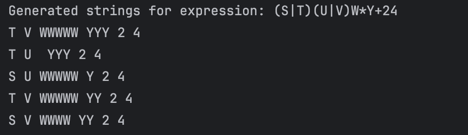
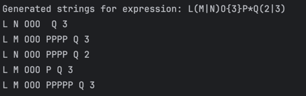
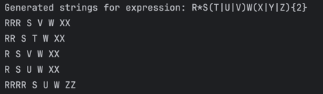

# Regular Expressions

### Course: Formal Languages & Finite Automata  
### Author: Mihaela Untu | FAF-232

---

## Theory

Regular expressions (regex) are a powerful formalism used to describe and match patterns in strings. They form the backbone of many parsing and lexical analysis techniques in compilers, search engines, and text-processing tools. In formal language theory, regular expressions define the class of regular languages, which can be recognized by finite automata.

A regular expression uses a combination of **symbols**, **operators**, and **quantifiers** to describe a language. Symbols are literal characters (like `a`, `b`, `1`, `x`), and operators include concatenation, union (`|`), Kleene star (`*`), and positive closure (`+`). Parentheses are used for grouping, allowing more complex expressions to be constructed.

The purpose of this lab work is to:
1. Understand how regular expressions are processed.
2. Build a tool to generate **valid strings** for given regexes.
3. Provide **step-by-step explanations** for how these expressions are interpreted.

---

## Objectives

1. Write and cover what regular expressions are, what they are used for;

2. Below you will find 3 complex regular expressions per each variant. Take a variant depending on your number in the list of students and do the following:

    a. Write a code that will generate valid combinations of symbols conform given regular expressions (examples will be shown).

    b. In case you have an example, where symbol may be written undefined number of times, take a limit of 5 times (to evade generation of extremely long combinations);

    c. Bonus point: write a function that will show sequence of processing regular expression (like, what you do first, second and so on)

Write a good report covering all performed actions and faced difficulties.

---

## Regular Expressions (Variant 4)


The regular expressions chosen for generation and analysis are:

1. `(S|T)(U|V)W*Y+24`
2. `L(M|N)O{3}P*Q(2|3)`
3. `R*S(T|U|V)W(X|Y|Z){2}`

Each expression defines a set of strings that follow a specific structure involving character choices, repetitions, and fixed suffixes. Our task is to **generate all matching strings** with a limited number of repetitions and explain how they are interpreted.

---

## Implementation Description

### `patterns.py`

`RegexPatterns` is a simple container class meant to store multiple regex pattern variants. Even though it only holds static data, wrapping it inside a class helps organize the code and group related constants together. 

`VARIANT_4` is a dictionary (key-value mapping) that holds three regex patterns. Each key (like `"regex_1"`) is a label for a particular regular expression, and the value is a string that represents the regex pattern. The `r` prefix (e.g., `r"(S|T)...`) indicates a raw string literal. In Python, raw strings treat backslashes (``) as literal characters, which is important for regex syntax — otherwise, Python would interpret backslashes as escape characters.
```python
class RegexPatterns:
    VARIANT_4 = {
        "regex_1": r"(S|T)(U|V)W*Y+24",
        "regex_2": r"L(M|N)O{3}P*Q(2|3)",
        "regex_3": r"R*S(T|U|V)W(X|Y|Z){2}"
    }
```

---

### `generator.py`

The `generator.py` file defines the `Generator` class, which is responsible for producing all valid strings that conform to the structure of the regular expressions defined in the patterns.py module. This generation is done without relying on external libraries, using only fundamental Python constructs such as loops and string operations.

The generator works by simulating the logic behind each regular expression, manually constructing combinations of characters that match the given pattern. To prevent infinite output due to operators like * (zero or more) and + (one or more), a strict upper limit of 5 repetitions is enforced wherever applicable.

`generate_regex_1()` method generates all valid strings for the expression `(S|T)(U|V)W*Y+24`. It begins by selecting one character from `'S'` or `'T'`, followed by another from `'U'` or `'V'`. Next, it appends between 0 to 5 occurrences of `'W'`, followed by 1 to 5 occurrences of `'Y'`, and concludes with the fixed suffix `'24'`.
Through a series of nested loops, it constructs every possible valid permutation that fits these constraints. This method ensures complete coverage of all allowed combinations while maintaining bounded repetition.
```python
class Generator:
    def generate_regex_1(self):
        results = []
        for a in ['S', 'T']:
            for b in ['U', 'V']:
                for w_count in range(0, 6):
                    for y_count in range(1, 6):
                        w = 'W' * w_count
                        y = 'Y' * y_count
                        results.append(f"{a}{b}{w}{y}24")
        return results
```
`generate_regex_2()` targets the pattern `L(M|N)O{3}P*Q(2|3)`. It begins each string with `'L'`, then selects one character from the set `'M'` or `'N'`. It appends exactly three `'O'` characters (as defined by `O{3}`), followed by 0 to 5 repetitions of the character `'P'`. Finally, it appends `'Q'` and ends the string with either `'2'` or `'3'`.
This function uses deterministic construction, iterating over all variations of `'P'` and suffix digits to ensure exhaustive generation of all valid strings under the specified limits.
```python
    def generate_regex_2(self):
        results = []
        for a in ['M', 'N']:
            for p_count in range(0, 6):
                for b in ['2', '3']:
                    p = 'P' * p_count
                    results.append(f"L{a}OOO{p}Q{b}")
        return results
```
`generate_regex_3()` constructs strings that match the regular expression `R*S(T|U|V)W(X|Y|Z){2}`. It begins with 0 to 5 occurrences of `'R'`, followed by the character `'S'`, and then one from the set `'T'`, `'U'`, or `'V'`. The next character is always `'W'`, and the expression concludes with two characters, each independently chosen from the set `{X, Y, Z}`—resulting in 9 possible suffix combinations.
To achieve this, the function uses nested loops that iterate through each valid character and repetition count. By doing so, it successfully produces all structurally correct strings according to the expression.

```python
    def generate_regex_3(self):
        results = []
        xyz = ['X', 'Y', 'Z']
        for r_count in range(0, 6):
            for a in ['T', 'U', 'V']:
                for x1 in xyz:
                    for x2 in xyz:
                        r = 'R' * r_count
                        results.append(f"{r}S{a}W{x1}{x2}")
        return results
```

---

### `steps.py`

The `steps.py` file contains the `Steps` class, which provides a human-readable, step-by-step breakdown of how each regular expression is interpreted and processed. This class is particularly useful for educational purposes, helping users understand the sequential logic behind each regular expression.

The class exposes a single method called explain, which takes the name of a regular expression (e.g., `regex_1`) and returns a list of strings, each representing a step in the pattern's evaluation.
```python
class Steps:
    def explain(self, regex_name):
        explanation = []

        if regex_name == "regex_1":
            explanation.append("Step 1: Match 'S' or 'T'")
            explanation.append("Step 2: Match 'U' or 'V'")
            explanation.append("Step 3: Match 0 to 5 occurrences of 'W'")
            explanation.append("Step 4: Match 1 to 5 occurrences of 'Y'")
            explanation.append("Step 5: Match the suffix '24'")

        elif regex_name == "regex_2":
            explanation.append("Step 1: Match 'L'")
            explanation.append("Step 2: Match 'M' or 'N'")
            explanation.append("Step 3: Match exactly 3 'O's")
            explanation.append("Step 4: Match 0 to 5 occurrences of 'P'")
            explanation.append("Step 5: Match 'Q'")
            explanation.append("Step 6: Match '2' or '3'")

        elif regex_name == "regex_3":
            explanation.append("Step 1: Match 0 to 5 occurrences of 'R'")
            explanation.append("Step 2: Match 'S'")
            explanation.append("Step 3: Match 'T', 'U', or 'V'")
            explanation.append("Step 4: Match 'W'")
            explanation.append("Step 5: Match two characters from {'X', 'Y', 'Z'}")

        return explanation
```

---

### `main.py`

The `main.py` file serves as the entry point of the regular expression generator program. Its primary function is to coordinate the generation of valid strings from regex patterns and to display their structure and examples in a readable format. It brings together the main components of the project—pattern definitions, the generator logic, and the step-by-step explanation of each expression.

The `print_examples` function is used to display the title of the regex expression (e.g., “Regular Expression 1”), print the actual regex string from the `RegexPatterns` dictionary, retrieve and display a list of step-by-step instructions using the steps() function, randomize and display ten sample strings from the list of all valid combinations.
```python
import random

from generator import Generator
from steps import steps
from patterns import RegexPatterns

def print_examples(title, pattern_name, examples):
    print(f"\n[{title}]")
    print("Regular Expression:", RegexPatterns.VARIANT_4[pattern_name])
    print("How it works:")
    for step in steps(pattern_name):
        print("  -", step)
    print("Examples:")
    random.shuffle(examples) # remove this for the first 10
    for ex in examples[:10]:  # show only 10
        print(" ", ex)
```
The main script begins by printing a title for context. It then creates an instance of the `Generator` class to access the generation methods for each of the three regex patterns. Each method is called in turn, and the resulting list of valid strings is passed to `print_examples()`, which handles the display and explanation.
```python
print("REGULAR EXPRESSION GENERATOR (VARIANT 4)\n")

generator = Generator()

regex_1_examples = generator.generate_regex_1()
print_examples("Regular Expression 1", "regex_1", regex_1_examples)

regex_2_examples = generator.generate_regex_2()
print_examples("Regular Expression 2", "regex_2", regex_2_examples)

regex_3_examples = generator.generate_regex_3()
print_examples("Regular Expression 3", "regex_3", regex_3_examples)
```

---

## Results

Running the script on the three expressions produces different sets of valid strings. Below are example outputs with screenshots:

### Regex 1 `(S|T)(U|V)W*Y+24`

---

### Regex 2 `L(M|N)O{3}P*Q(2|3)`

---

### Regex 3 `R*S(T|U|V)W(X|Y|Z){2}`

---

## Conclusions

In this lab, the generation of valid strings from regular expressions was analyzed and implemented. We built a modular Python tool that interprets regex definitions, generates matching strings up to a bounded depth, and explains the internal processing steps for each pattern. This lab helped solidify our understanding of regular languages and gave us a hands-on approach to working with regex in a theoretical and practical context.

---

## References

1. [Regular Expressions - Wikipedia](https://en.wikipedia.org/wiki/Regular_expression)  
2. [Formal Language Theory](https://en.wikipedia.org/wiki/Formal_language)  
3. [Python Regex Tutorial (Built-in Syntax)](https://docs.python.org/3/library/re.html)
