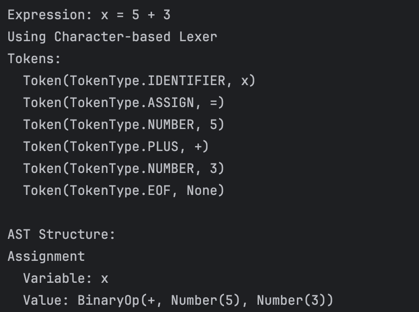
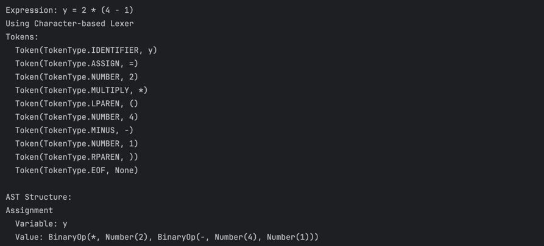
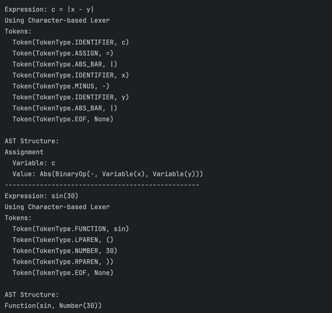

# Topic: Parser & Building an Abstract Syntax Tree

### Course: Formal Languages & Finite Automata

### Author: Mihaela Untu | FAF-232

---

## Theory
So parsing (or syntax analysis) is basically breaking down a string of symbols according to grammar rules. The name "parsing" actually comes from Latin "pars" meaning "part of speech" - didn't know that until researching for this project!

In computer science, parsing is super important for anything from programming languages to processing math expressions. When we parse, we're taking input text, breaking it down into parts based on formal grammar, and building a data structure that shows how everything fits together.

An Abstract Syntax Tree (AST) is the data structure we use to represent code structure. It's called "abstract" because it doesn't include every single syntax detail (like parentheses) - instead, it focuses on showing the relationships between different parts of the expression. For math expressions, ASTs are really useful because they make it easy to see the hierarchy of operations and evaluate things in the right order.

## Objectives
1. Get familiar with parsing, what it is and how it can be programmed [1]. 
2. Get familiar with the concept of AST [2]. 
3. In addition to what has been done in the 3rd lab work do the following:
   1. In case you didn't have a type that denotes the possible types of tokens you need to:
      1. Have a type TokenType (like an enum) that can be used in the lexical analysis to categorize the tokens. 
      2. Please use regular expressions to identify the type of the token.
   2. Implement the necessary data structures for an AST that could be used for the text you have processed in the 3rd lab work.
   3. Implement a simple parser program that could extract the syntactic information from the input text.
## Implementation

My implementation has several main components that work together:

### 1. Tokenizer and Lexer

I implemented two different lexers to try different approaches:

```python
class TokenType(Enum):
    NUMBER = auto()
    PLUS = auto()
    MINUS = auto()
    MULTIPLY = auto()
    DIVIDE = auto()
    POWER = auto()
    FACTORIAL = auto()
    MODULUS = auto()
    LPAREN = auto()
    RPAREN = auto()
    ASSIGN = auto()
    IDENTIFIER = auto()
    FUNCTION = auto()
    ABS_BAR = auto()
    EOF = auto()
```

The first lexer is character-based and goes through the input character by character, which was pretty straightforward to implement but a bit tedious.

The second one uses regex patterns to match tokens, which turned out to be way more efficient:

```python
def tokenize(self):
    pos = 0
    while pos < len(self.text):
        match = self.regex.match(self.text, pos)
        if not match:
            raise Exception(f"Invalid token at position {pos}: {self.text[pos:]}")

        group = match.lastgroup
        if group != 'WHITESPACE':
            value = match.group()
            token_type = getattr(TokenType, group)

            # Convert number strings to actual numbers
            if token_type == TokenType.NUMBER:
                value = float(value) if '.' in value else int(value)

            self.tokens.append(Token(token_type, value))

        pos = match.end()

    # Add EOF token
    self.tokens.append(Token(TokenType.EOF, None))
```

This regex approach is pretty cool because it can find all tokens in a single pass through the text.

### 2. AST Node Structure

For the AST, I created a hierarchy of node classes to represent different parts of math expressions:

```python
class Node:
    def __init__(self):
        pass

    def __str__(self):
        return self.__class__.__name__
```

I then extended this base class with specific node types:

- **BinaryOpNode**: For operations like +, -, *, /, etc.
- **UnaryOpNode**: For things like negation (-x) or factorial (x!)
- **NumberNode**: For numeric values
- **VariableNode**: For variable references
- **AssignmentNode**: For variable assignments (x = y)
- **FunctionCallNode**: For functions like sin(), cos()
- **AbsoluteValueNode**: For absolute values |x|

Here's what my BinaryOpNode class looks like:

```python
class BinaryOpNode(Node):
    def __init__(self, left, op, right):
        super().__init__()
        self.left = left
        self.op = op
        self.right = right

    def __str__(self):
        return f"BinaryOp({self.op.value}, {self.left}, {self.right})"
```

### 3. Parser Implementation

The parser was the trickiest part. I implemented a recursive descent parser following this grammar:

```
Grammar:
expr        : assignment
assignment  : identifier = expr | add_expr
add_expr    : mul_expr ((+|-) mul_expr)*
mul_expr    : pow_expr ((*|/|%) pow_expr)*
pow_expr    : unary_expr (^ unary_expr)*
unary_expr  : -factor | factor | factor!
factor      : num | identifier | func_call | (expr) | |expr|
func_call   : identifier(expr)
```

The cool thing about recursive descent parsing is how it naturally handles operator precedence. Here's my code for parsing addition/subtraction (which have lower precedence than multiplication/division):

```python
def add_expr(self):
    node = self.mul_expr()

    while (self.current_token and
           self.current_token.type in (TokenType.PLUS, TokenType.MINUS)):
        op = self.current_token
        self.advance()
        right = self.mul_expr()
        node = BinaryOpNode(node, op, right)

    return node
```

What this does is first parse a multiplication expression (higher precedence), then check if there's a + or - operator. If there is, it creates a binary operation node with the multiplication expression as the left child.

The parser can handle all kinds of math stuff:
- Basic arithmetic (+, -, *, /, %, ^)
- Unary operations (-, !)
- Parenthesized expressions
- Function calls (sin, cos, etc.)
- Absolute value expressions
- Variable assignments

### 4. AST Visualization

Debugging ASTs can be a pain, so I made a visualizer to help see what's going on:

```python
class ASTVisualizer:

    def __init__(self):
        self.indent_level = 0
        self.indent_size = 2

    def visualize(self, node):
        if node is None:
            return "None"

        result = []
        self._visualize_node(node, result)
        return "\n".join(result)
```

This creates a text representation of the tree using indentation to show the hierarchy.

## Results and Screenshots

I wrote a bunch of test cases to make sure everything was working correctly. Here are some examples of expressions I tested:

- Simple numbers: `3.14`
- Variable assignments: `x = 5 + 3`
- Complex expressions: `y = 2 * (4 - 1)`
- Function calls: `sin(30)`
- Unary operations: `5!`, `-4.5`
- Absolute values: `|x - y|`

Here's what parsing `x = 5 + 3` looks like:



For more complex expressions like `y = 2 * (4 - 1)`, the AST correctly handles precedence:



This shows that the AST correctly represents the multiplication of `2` with the result of `4 - 1`.

And here are some other examples for absolute value and predefined functions.


## Conclusions

Overall, I'm pretty happy with how this project turned out. I was able to successfully create two different lexers 
(character-based and regex-based), build an AST structure that can represent all kinds of math expressions, implement a 
parser that correctly handles operator precedence, and create a visualizer to help debug the AST.
The most challenging part was definitely getting the parser right, especially making sure all the precedence rules were 
followed correctly. The recursive descent approach worked well for this, but I had to be careful with the grammar rules.
This project gave me a much better understanding of how compilers and interpreters work under the hood. It's pretty cool
to see how formal language theory can be applied to build something practical.
In the future, I'd like to extend this to include an evaluator to actually calculate the results of expressions, support 
for more functions and operations, and better error handling and recovery.

## References
[1] [Parsing Wiki](https://en.wikipedia.org/wiki/Parsing)

[2] [Abstract Syntax Tree Wiki](https://en.wikipedia.org/wiki/Abstract_syntax_tree)